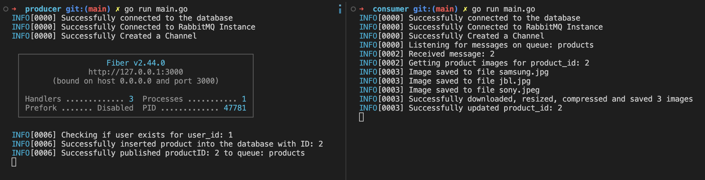

# Message Queuing System

This is a message queuing system implemented in Go programming language and RabbitMQ. The system comprises of an API, a Producer, and a Consumer.

## API

The API receives product data and stores it in the database. The following parameters should be passed in the API:

- user_id 
- product_name
- product_description (text)
- product_images (array of image urls)
- product_price (Number)

## Producer

After storing the product details in the database, the product_id is passed on to the message queue.

## Consumer

Based on the product_id, product_images are downloaded, compressed, and stored in local. After storing, a local location path is added as an array value in the products table in the compressed_product_images column.

## Database Schema

### Users

- id - int, primary key
- name - Name of the users
- mobile - Contact Number of the user
- latitude - Latitude of the user’s location
- longitude - Longitude of the user’s location
- created_at
- updated_at

### Products

- product_id - int, primary key
- product_name - string, Name of the product
- product_description - text, About your product
- product_images - array
- product_price - number
- compressed_product_images - array
- created_at
- updated_at

## Setup

A docker-compose file is included with MySQL and RabbitMQ, and an init.sql file to initialize the database. To run the project, install Go, Docker, and Docker-compose, and then run `docker-compose up -d` to start the containers.

There are two folders - producer and consumer. Open two terminals and run the `main.go` files. Access the API via `localhost:3000/swagger`.

Example Request:

```json
{
    "user_id": 1,
    "product_name": "Headphones",
    "product_description": "This Headphones will blow your mind!",
    "product_images": [
        "https://raw.githubusercontent.com/harikrishnanum/products/main/samsung.jpg",
        "https://raw.githubusercontent.com/harikrishnanum/products/main/jbl.jpg",
        "https://raw.githubusercontent.com/harikrishnanum/products/main/sony.jpeg"
    ],
    "product_price": 10000
}
```

Or you can use the following curl command:

```bash
curl -X 'POST' \
  'http://localhost:3000/products' \
  -H 'accept: application/json' \
  -H 'Content-Type: application/json' \
  -d '{
    "user_id": 1,
    "product_name": "Headphones",
    "product_description": "This Headphones will blow your mind!",
    "product_images": [
        "https://raw.githubusercontent.com/harikrishnanum/products/main/samsung.jpg",
        "https://raw.githubusercontent.com/harikrishnanum/products/main/jbl.jpg",
        "https://raw.githubusercontent.com/harikrishnanum/products/main/sony.jpeg"
    ],
    "product_price": 10000
}'
```

To view the database in a Docker container running MySQL, follow these steps:

```
docker exec -it mysql mysql -p
```

1. When prompted for a password, enter the password specified in the `docker-compose.yml` file (in this example, the password is "example").
2. You should now be connected to the MySQL command line interface. From here, you can view, modify, or query the database as needed.

Note: This assumes that you have Docker and Docker Compose installed on your system.
<hr/>

## Screenshots
Producer and Consumer runnnig in two terminals



## Testing
Instructions for testing the producer and consumer components of the codebase using unit tests and integration tests:

Unit Testing:
1. Open a terminal window and navigate to the "producer" directory of the codebase using the `cd` command.
2. Run the command `go test ./...` to execute all the unit tests for the producer component.
3. Open another terminal window and navigate to the "consumer" directory of the codebase using the `cd` command.
4. Run the command `go test ./...` to execute all the unit tests for the consumer component.

Integration Testing:
1. Open a terminal window and navigate to the root directory of the codebase. `golang_backend_assignment`
2. Make the `integration_test.sh` script executable by running the command `chmod +x integration_test.sh`.
3. Run the integration tests by running the command `./integration_test.sh` in the terminal window.
4. The integration tests will execute the producer and consumer components and verify that messages are correctly produced, consumed, and processed.

Note: Make sure that all the dependencies required for testing are installed on your system. Also, ensure that the environment variables required for running the codebase are set correctly before running the tests.


## Dev Notes
### Installing Go
1. Visit the official Go downloads page at https://golang.org/dl/
2. Download the appropriate binary release for your operating system and architecture.
3. Install Go by following the instructions for your operating system.
### Installing Docker
```bash
curl -s https://raw.githubusercontent.com/harikrishnanum/Distributed-IOT-ML-Platform/main/bootstrap/install-docker.sh | bash
```
